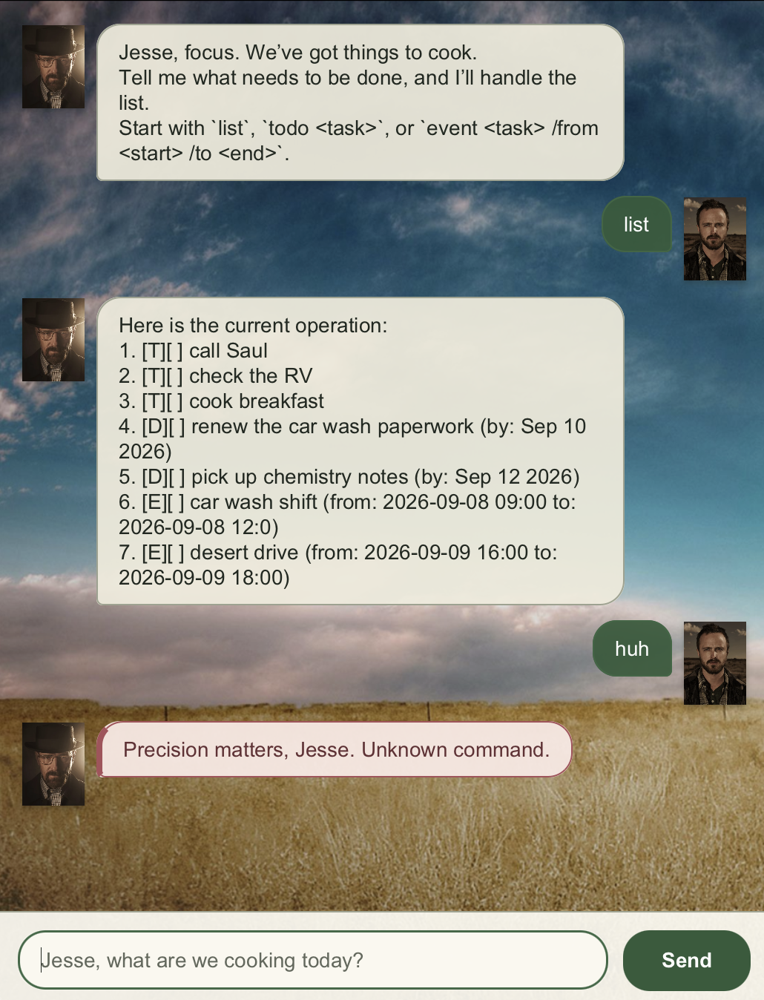

# Walter User Guide

Walter is a desktop chatbot that helps you keep track of tasks, deadlines, events, and useful
places. Give Walter a precise command and he will keep the operation organised.

Walter can add, update, search, and remove tasks. He can also record addresses that you want to
keep nearby.

## Quick start

1. Launch Walter and wait for the conversation window to appear.
2. Type a command in the input field.
3. Press **Enter** or select **Send**.
4. Read Walter's reply in the conversation above the input field.

Task and place changes are saved automatically and restored the next time Walter starts.

## Features

### Add a todo

Use `todo DESCRIPTION` to add a task without a date or time.

Example: `todo read the chemistry notes`

The description must not be empty.

### Add a deadline

Use `deadline DESCRIPTION /by yyyy-MM-dd` to add a task due on a particular date.

Example: `deadline submit project report /by 2026-10-16`

The date must be a real calendar date written in year-month-day format. Use exactly one `/by`
between the description and date.

### Add an event

Walter accepts two event formats:

- `event DESCRIPTION /at TIME`
- `event DESCRIPTION /from START /to END`

Examples:

- `event project consultation /at Monday 2pm`
- `event laboratory session /from Tuesday 10am /to 12pm`

Use either one `/at`, or one `/from` followed by one `/to`. Event times are saved as the text you
enter; Walter does not check whether they represent real dates or times.

### List tasks

Use `list` to display every task and its number.

Example: `list`

Completed tasks display an `X` in their status box.

### Mark a task as done

Use `mark INDEX` or its alias `done INDEX` to mark a task as completed.

Example: `mark 2`

### Mark a task as not done

Use `unmark INDEX` to return a completed task to its unfinished state.

Example: `unmark 2`

### Delete a task

Use `delete INDEX` to remove a task.

Example: `delete 3`

For task commands that use an index, enter the number shown by `list`.

### Find tasks

Use `find KEYWORD` to find tasks whose descriptions contain the keyword. Matching is not
case-sensitive.

Example: `find report`

### View deadlines on a date

Use `on yyyy-MM-dd` to display deadlines due on a particular date.

Example: `on 2026-10-16`

This command searches deadline tasks only. The date must be a real calendar date in
year-month-day format.

### Save a place

Use `place NAME /at ADDRESS` to save a named location.

Example: `place Central Library /at 12 Computing Drive`

The name and address must not be empty, and the command must contain exactly one `/at`.

### List places

Use `places` to display every saved place and its number.

Example: `places`

### Delete a place

Use `deleteplace INDEX` to remove a saved place.

Example: `deleteplace 1`

Enter the place number shown by `places`.

### Exit Walter

Use `bye` to end the conversation.

Example: `bye`

## Input rules

- Commands and required descriptions cannot be blank.
- For task and place commands, use the positive number shown by `list` or `places`.
- Deadline and `on` dates use `yyyy-MM-dd`, for example `2026-10-16`.
- Delimiters such as `/by`, `/at`, `/from`, and `/to` must be separate tokens with the required
  text on each side.

## Command summary

| Action | Command |
| --- | --- |
| Add a todo | `todo DESCRIPTION` |
| Add a deadline | `deadline DESCRIPTION /by yyyy-MM-dd` |
| Add an event at a time | `event DESCRIPTION /at TIME` |
| Add an event with a range | `event DESCRIPTION /from START /to END` |
| List tasks | `list` |
| Mark a task as done | `mark INDEX` or `done INDEX` |
| Mark a task as not done | `unmark INDEX` |
| Delete a task | `delete INDEX` |
| Find tasks | `find KEYWORD` |
| View deadlines on a date | `on yyyy-MM-dd` |
| Save a place | `place NAME /at ADDRESS` |
| List places | `places` |
| Delete a place | `deleteplace INDEX` |
| Exit Walter | `bye` |
